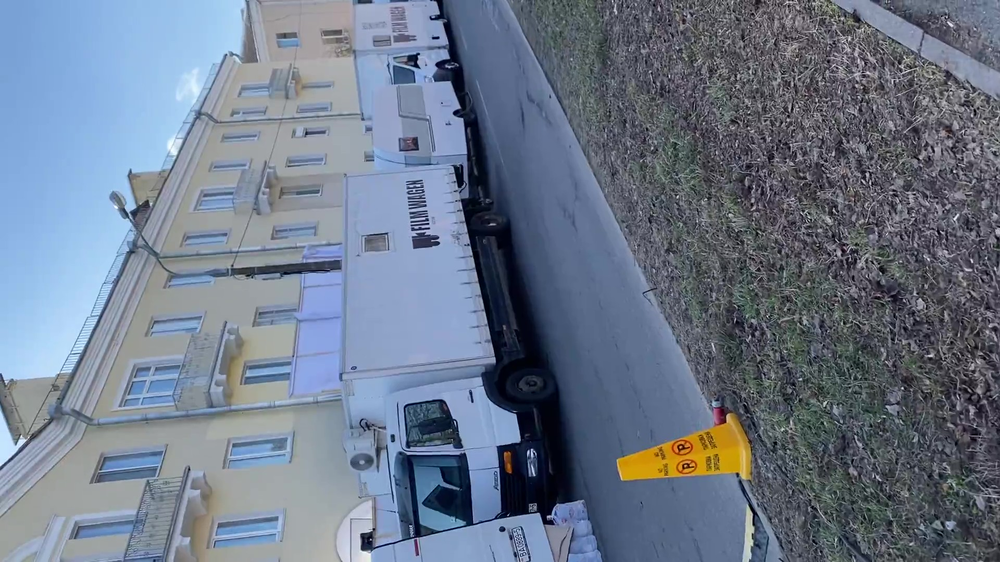
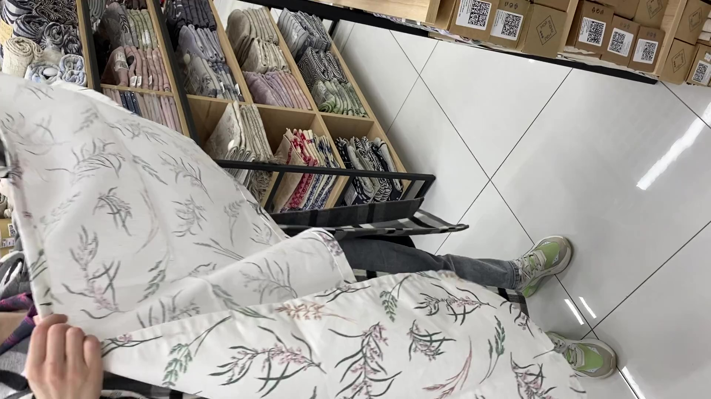
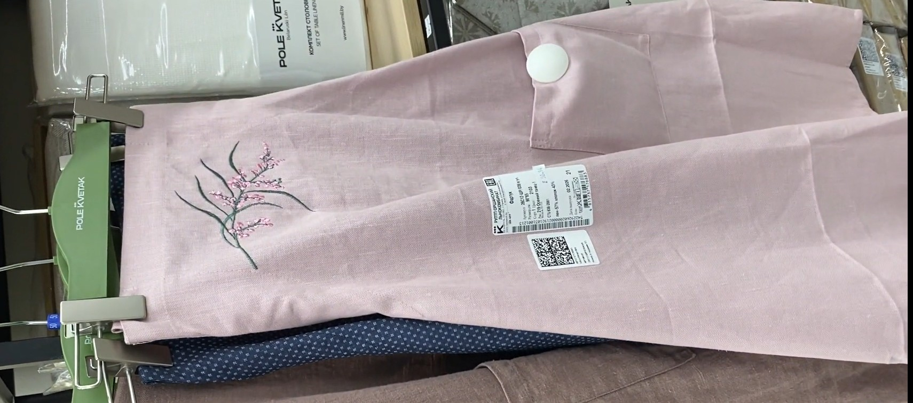
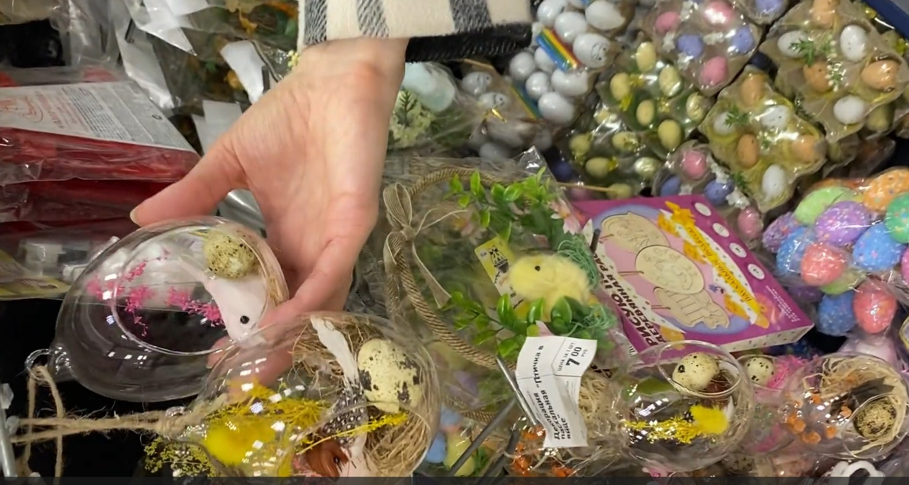
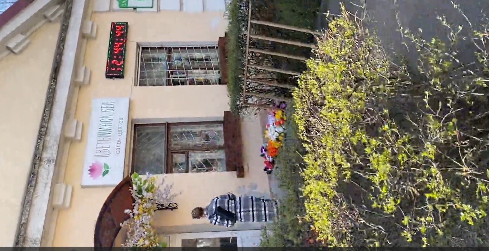
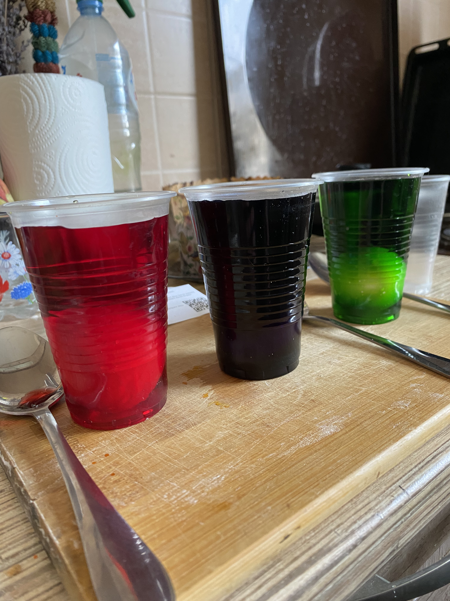
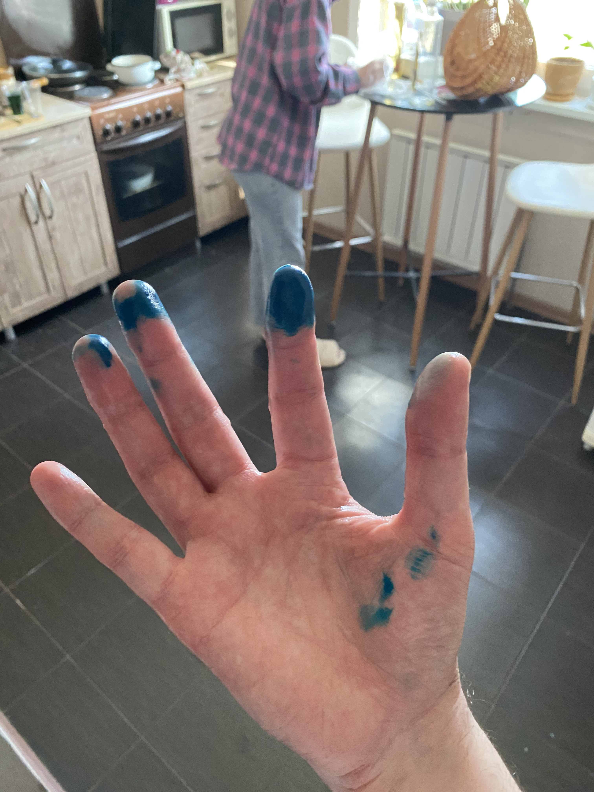
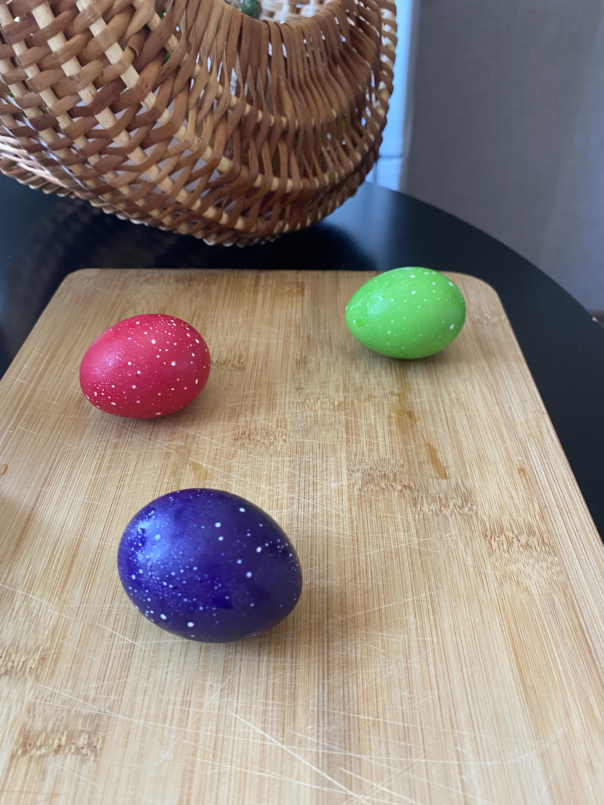
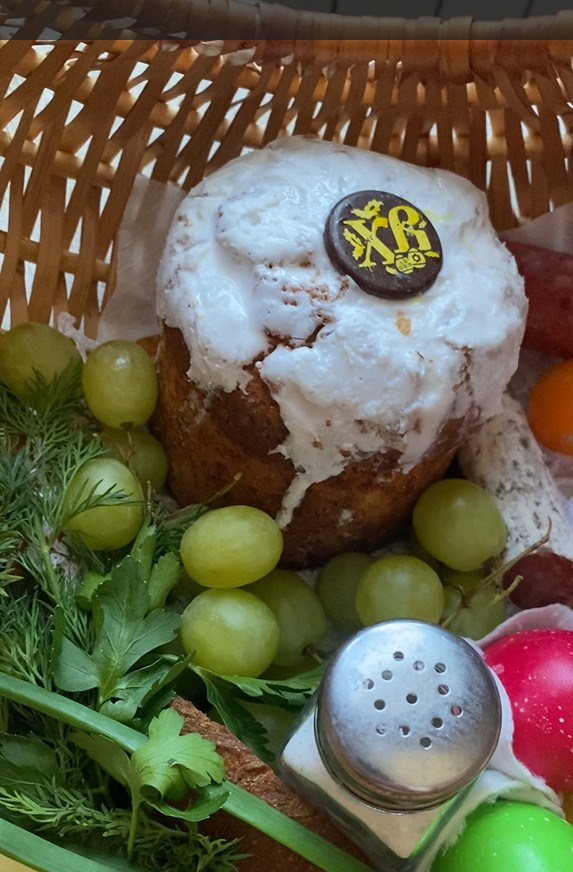

# The bless of Easter basket.
## 04.04.26
## The morning prepare for next day celebrating
### The stroll 
My wife and I woke up early in the morning and went shopping. We walked to the supermarket Momo. It was fresh morning stroll. We live in the old district with beautiful historical old two- or three-story buildings. So that now in our district is filming a new series. A famous singer is taking part in this series.

###  In MOMO
In the supermarket we stopped in the store of belarus textile.
I really liked this round tablecloth. This is a beautiful display.

I enjoy this beautiful aprons.

We finally bought a funny towel with a goose picture.

### In Fix Price
After that we visited Fix Price. We looked at some funny decorations for the celebration table.

We stopped at a good plate for eggs. And bought it.

### The Flower shop
As the final step, we visited a flower shop. Because we needed the for the festive table.

### The painting eggs
When we got home we boiled 6 eggs.
After that I prepared particular food coloring. I could choose several options and my wife decide it would be red, green and violet colors. The started pack had only three color and for other color I had to mix in the right proportions.

It was a really interesting process. I was really focused so that I got  my fingers dirty.

The result was brilliant. I have on tip. I saw on Tik-Tok eggs should stay in the mixture for at least 15 minutes.

### The blessing basket
We prepared an easter basket for blessing.
We put into the basket a cake, a spring onions, colored eggs, bread, sausage cut by half and grapes.

In our church food is blessed every hour. I really want to make it in time. I arrived at the church in 13.59. I put the car on a free space. I saw a coupe of girl hurrying, and fallowed by them. There were so many people so that the end of queue was outside in the yard. I stayed in the line. The priest came out and blessed our baskets.

