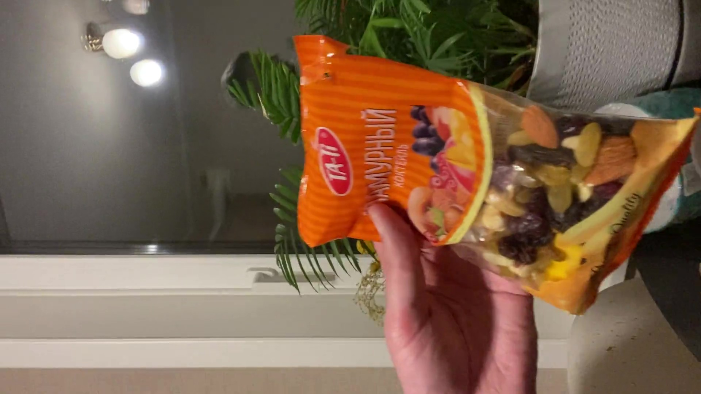
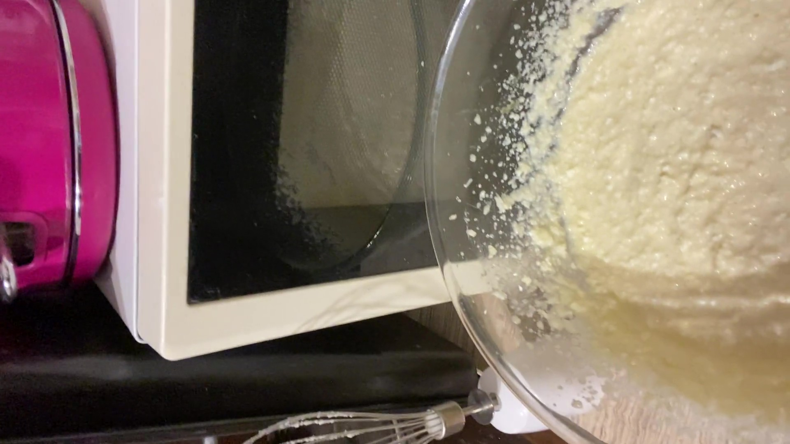
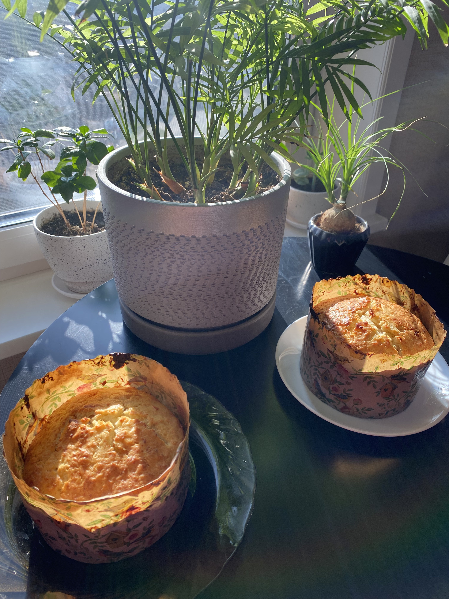

# The cooking Easter cake 2026
## 03.03.26
## Friday. Cooking.
### The cooking of my custom Easter cakes.
Right now curds cakes are really popular. And the perfect thing that you can easy few at once. You don't need any specially skills.  
I ended my workday and went to the home. Before that, I bought some curd and a raisin mixture. I already had other ingredient at home.

I mixed 180g of butter with 300g of sugar and added 1 teaspoon of vanilla sugar. First, I cut the butter into small pieces with a knife and the blended it until smooth. Next, I added the curd and blended everything together to make a creamy mixture. After that, I piked the raisins out of the raisin-and-nut and set them aside. Then, I added 300g of flour and 1 teaspoon of baking powder. I mixed everything until it formed a smooth dough. I divided the mixture into two paper form. I put in a preheated oven by 180 degrees. I covered form by foil and baked 20 minutes. After I removed foil and baked for an additional 30 minutes until golden.

These cakes are perfect. They are delicious and juicy. I was really happy.

