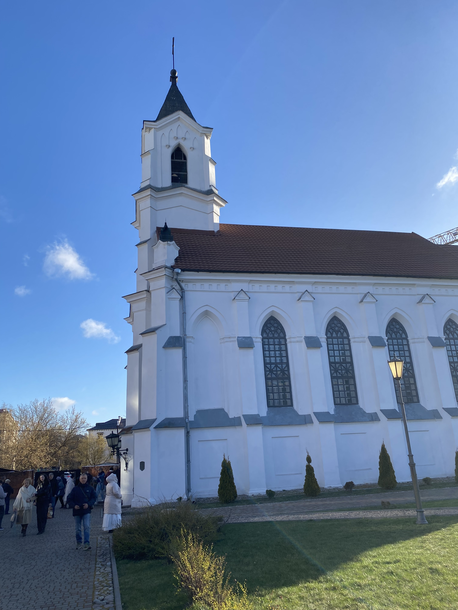
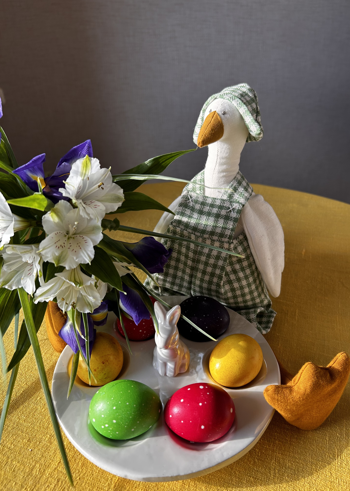
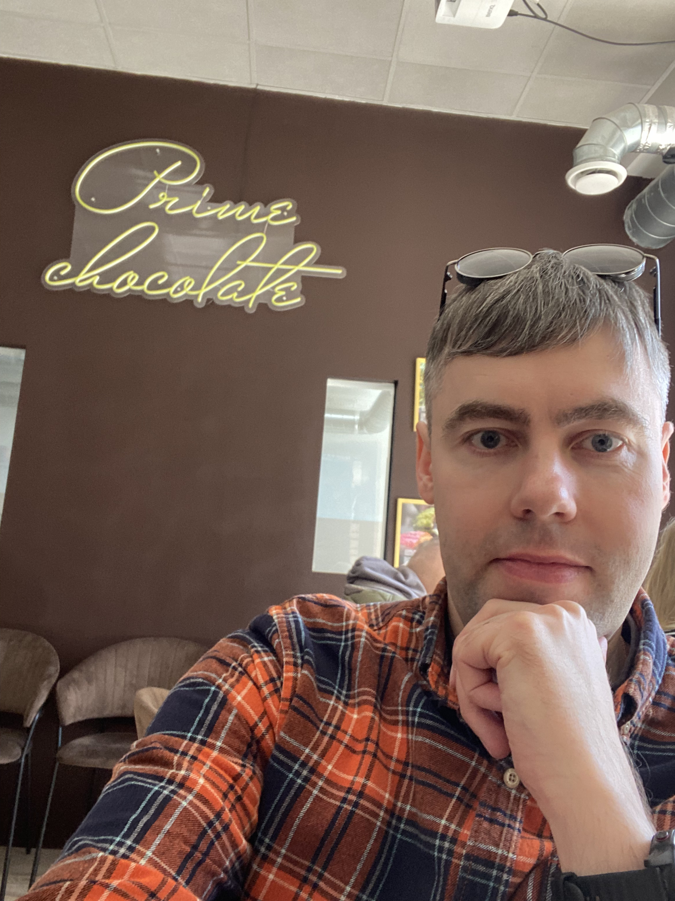
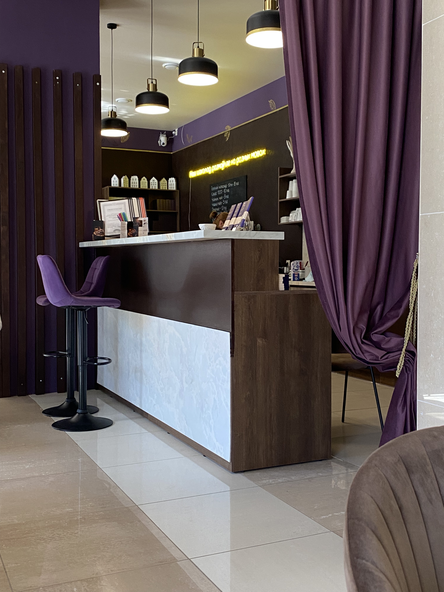
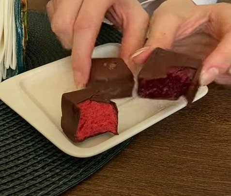
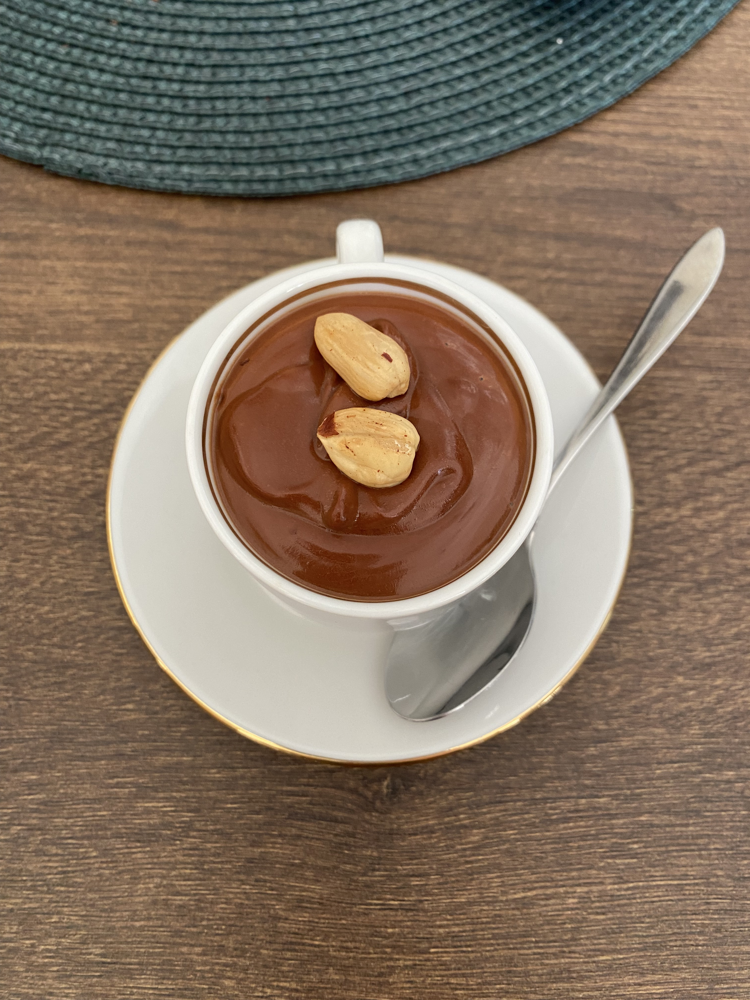
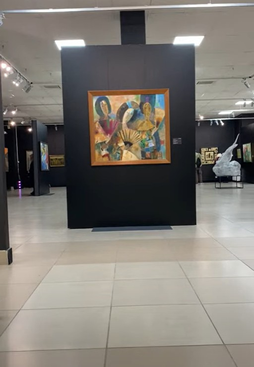
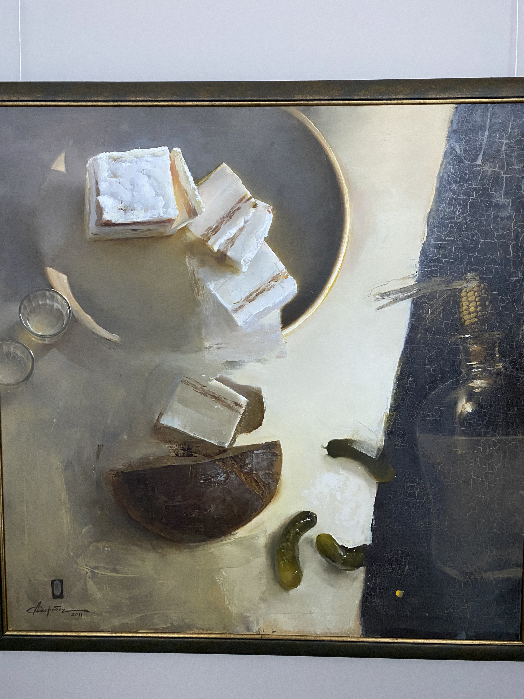
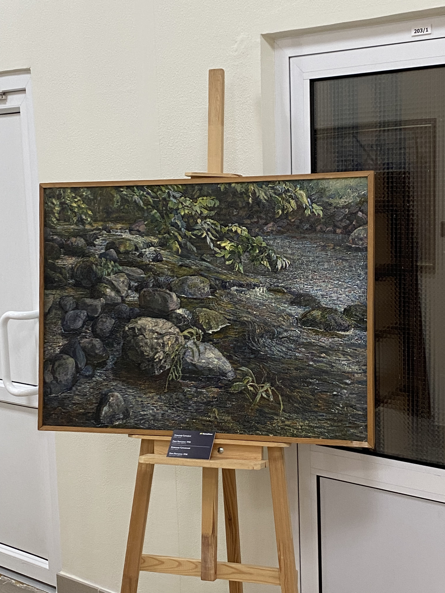
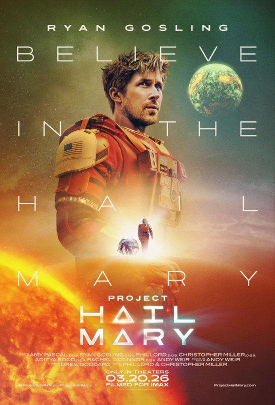

# Easter and the Celebration.
## 05.04.26
## The Morning
### In The Church
The first morning mass started really early at 7 AM. My wife and I got up, took a shower and used a car-sharing service. The free car was available near our house.
Our parish located in the city center. We parked the car in a free space in front of the Palace of Arts and went to the church. 
It was the cold day. In Belarus usually on Catholic Easter is cold weather. There were a lot of people.  
The parish priest led the mass. It felt very festive and solemn.

After the mass I congratulated my family and friends with the phrase "Chrystus zmartwychwstał!". And got answer "Prawdziwie zmartwychwstał!".

My wife and I went home to celebrate Easter breakfast. The Lenten fast was over. We each took a colored egg and cracked them together, My wife beat me in this traditional game. We enjoyed meals we had prepared.

## The Day
### The New Famous Chocolate Café
After the breakfast we returned to the city center to visit a new cafe which specializes on chocolate. This cafe has so good chocolate that many bloggers said that it is just like in europe.

The space inside café is sufficient. But there are only few tables so that it got packed very fast. We got lucky and found a free spot. The atmosphere is really chill with nice music. I think they tried to create a calm space where people could relax. However, in my opinion, this stuffs seem a bit slowly because it.

The chocolate is really delicious and awesome. But also quite expensive. It feels like premium, authentic product . I really enjoyed candy with strawberry and blackcurrant filling. The third candy was good as well, but I didn't like it as much as the ones I tried before.

We got a couple cups of hot chocolate and some ice cream. This combination was perfect. As you can imagine, the hot chocolate is quiet expensive too. An interesting fact: the menu café doesn't serve at all coffee because it doesn't go well to chocolate.

### The Exhibition Panting From Storage BelGazPromBank
The weather outside was wonderfully sunny, but still pretty cold in the shade. We walked through the park to our next point. It was the museum of Minsk history. The second floor featured a new art exhibition of paintings that had never been shown before.

I was interested in a painting of Alesia Skorobogataj that I had never seen before. I like her style, her work. But all her paintings are far much expensive. I dream that if I became rich, I would buy some of her works.

There was an interesting show with live paintings. With projectors was created the whole story about characters from paintings, which were going on the wall. It was with a story that explained a plot and philosophic thoughts.

I really liked the picture at the end of the hall. It seems good at a distance. It pictured a river.

## The Evening
### The Moon Cinema and Ryan Gosling
I got a certificate for Moon cinema from professional union at my work. I suggested my wife to visit the cinema as good ending of this saturated day. I wanted to watch a new movie about space and alien. 

My wife said she's rather watch so longer movie at home. But I convinced her. The movie was really awesome, I liked the alien character. My wife call it cute. Generally space movies aren't my kind of movies. But this one I really love.  

