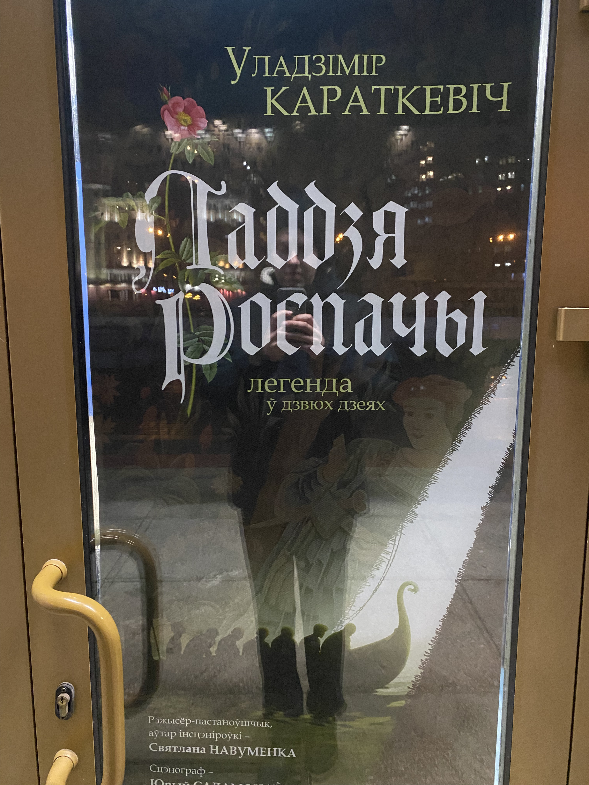
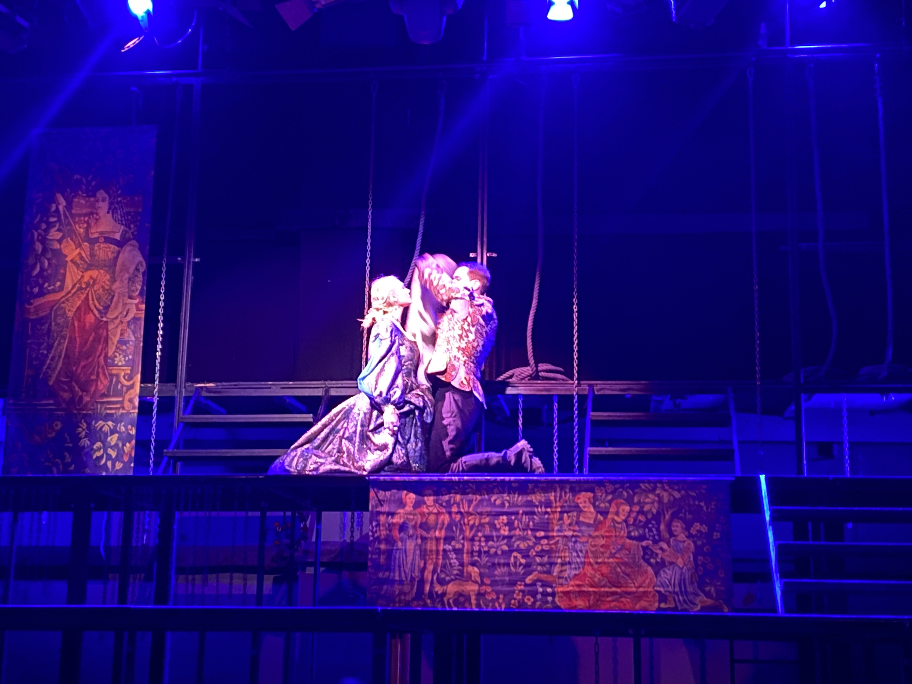
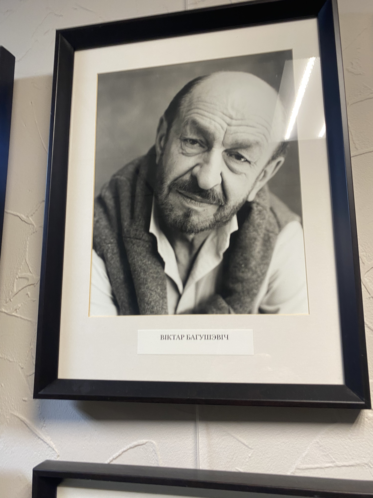
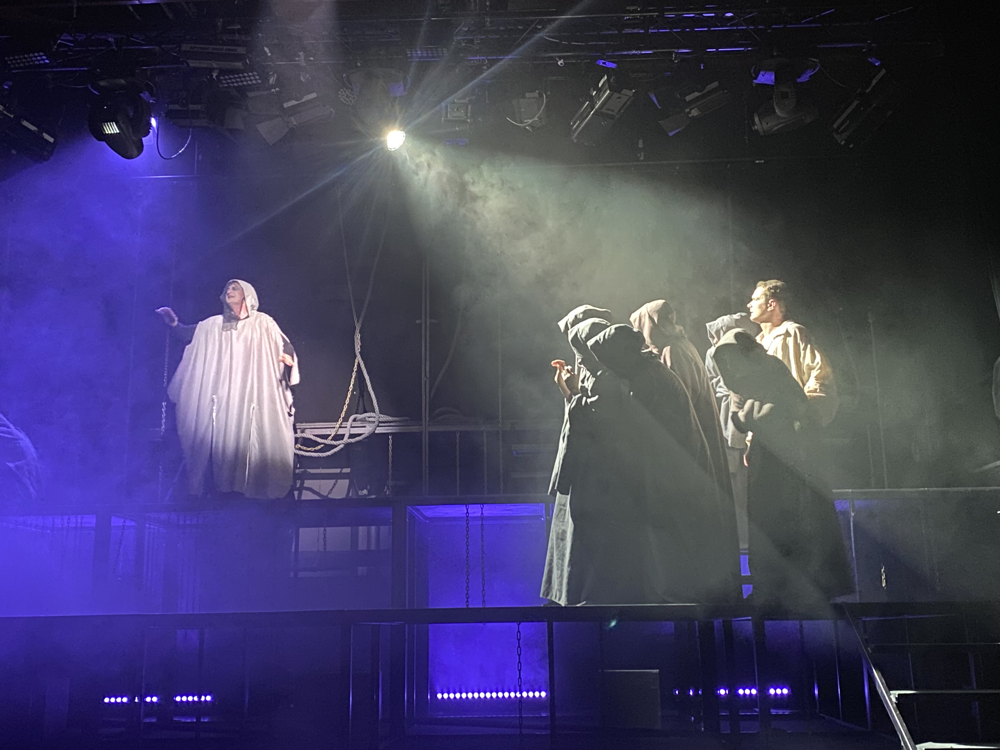

# Laddzia Rospaczy
## 11.04.202
### Unexpected possibility
My college suggested me to buy a couple tickets on a play "Laddzia Rospaczy" by belarusian writer Uładzimir Karatkiewicz.
It is a premiere. But He couldn't visit because Orthodox Easter. I was glad and bought tickets for this play.

A plot was full mystic from belarusian country tales. It remembered me even plot from another book "Wiedźmin". Historical characters, atmosphere mediaeval Belarus created good impression. 

I enjoyed a comedian scenes that was full the first part of the play. I especially liked the old artis, who played the second role. But He was so funny and played very well. After the play I even gave him a bunch of flower. I saw another people gifted flower to second characters too. After the play I found his photo in a hall. It was very famous artis just old.  

The plays created strong emotions of struggling with injustice and laughing facing death bravely.

