# The art exhibition Sky.River.2026
## 28.03.26
## Enter
### Building
The art centre is located in historic industrial building - an old "Horizont" factory.
Its red-brick walls are beautiful and these days this have become unexpectedly expensive. It the yard are located several cafes. This is a kind of places where you could drink cup of coffee before or after the exhibition.
### Ticket
The ticket for an adult is quite expensive, especially on weekend. It's 59 rubles.
### People
Maybe I was lucky, but we arrived there were a few of people inside. I was glad I don't have to queue to get in.

I enjoy visiting places that are almost empty. I don't like packed places. In the idea case it would only me and my wife are wandering through space. 
## Exposition
### Sewing threads
This activity consist of creating kind of map made from statements. There are several color threads.
You take a thread and stretch it across the wall. I try to stick the thread on the higher screws. It was funny.
### Central area
Here you suddenly find yourself in centre of jungle kind of a lost world. There are a several activities to try. You could play on the piano, if you are able to make it, or sit and paint a painting if you feel a inspiration.
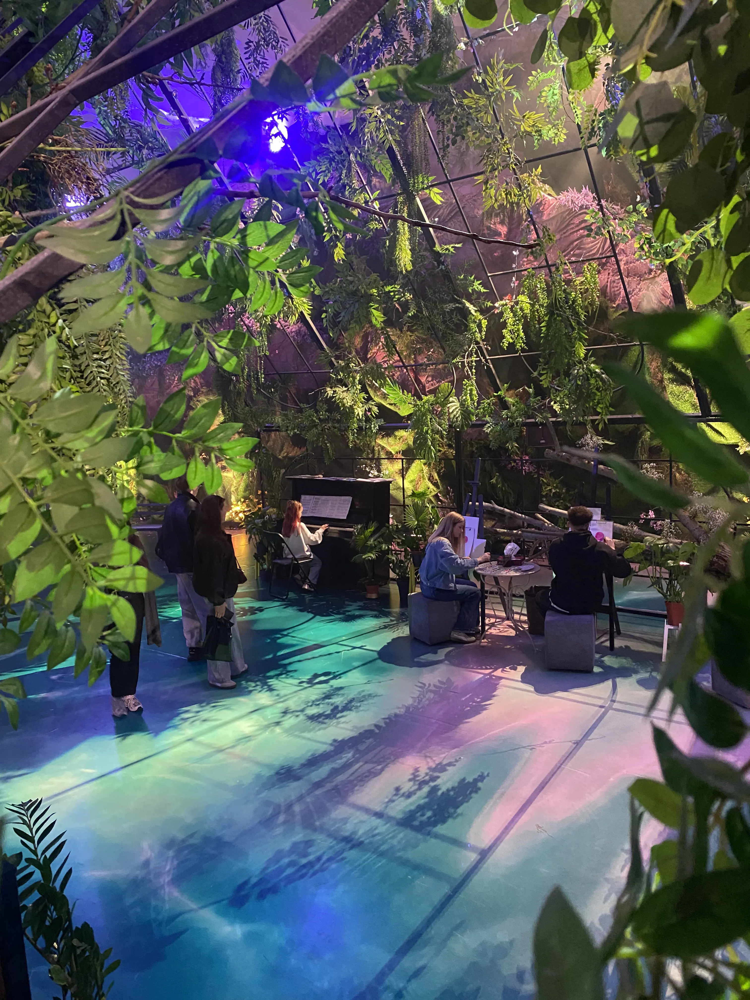
### Bridge
I enjoyed this installation.
You could walk across the bridge hanged under water.
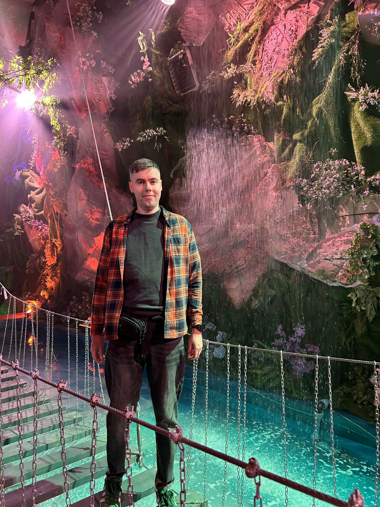
There is around jungle with blue river, dense plants, gray cliff and even a full waterfall. The digital sounds of jungle and relaxing music surrounded us. The light imitates cycle of day: sunset, night, sunrise, day.
It felt like the lost world.
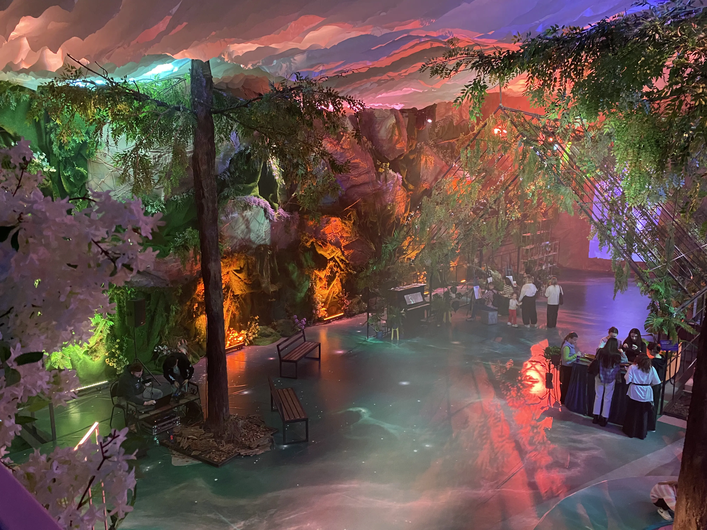
When you walk on a surface of the bridge it is swinging beneath your feet.
You could write a message on the color ribbon and attach it on the bridge.
### Library
On the second floor is located a whole library in the middle of jungle. I really like to read. I subscribed on the reddit public about interesting home libraries so that I was glad this installation.
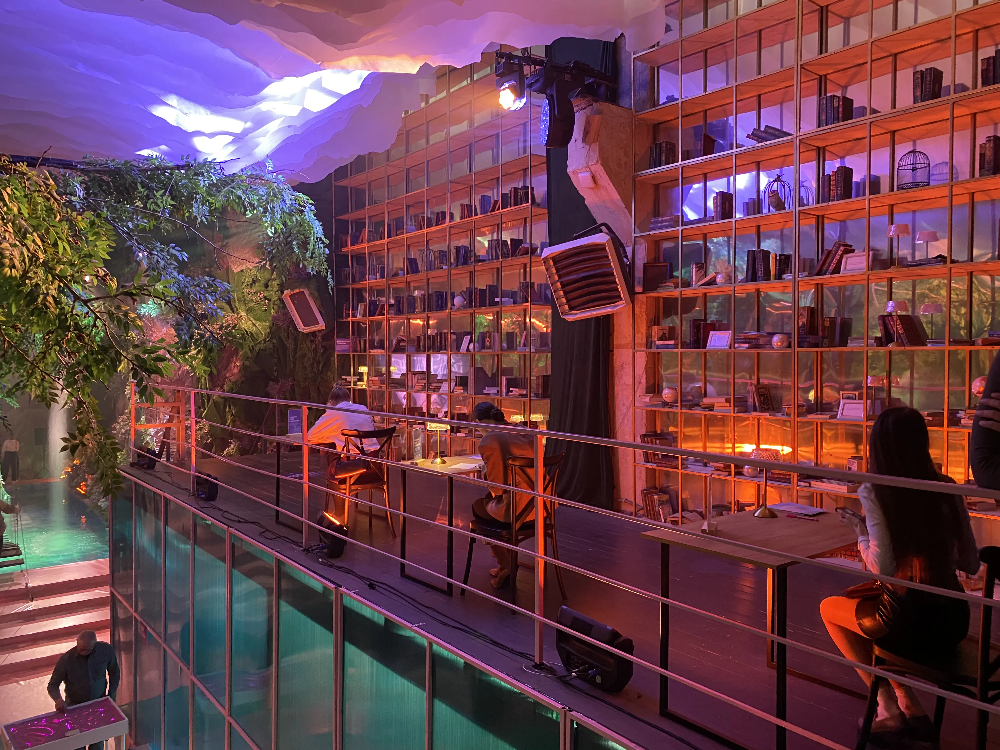
All books on the shelves is enough interesting. Some of them I had already read. I enjoyed some decorative objects like a desk lamp from kristal or small globe.
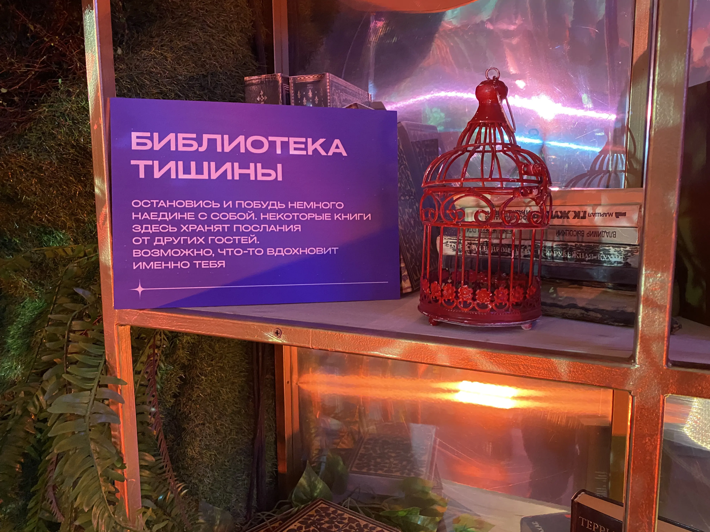
I would like this shelving for my future home library.  
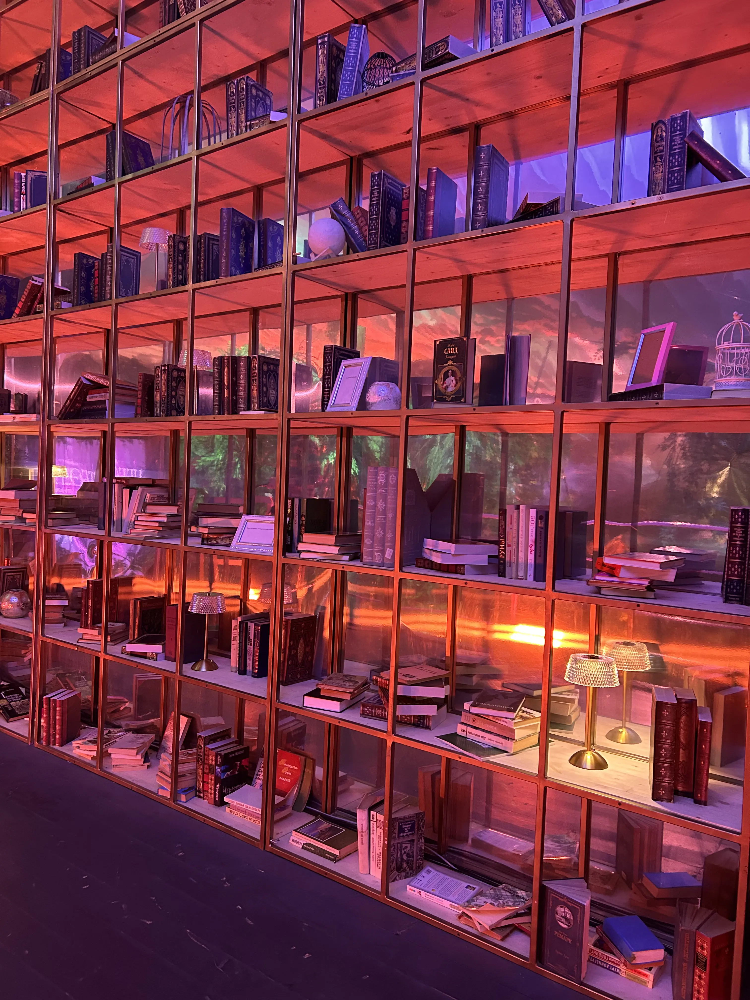
On the desk you could write a message for yourself and then organisers would send to your home a brief with this message.
### Cave
There is build a whole cave of butterflies. Walls inside the cave are decorated by flower. The lighting looks like flying butterflies.
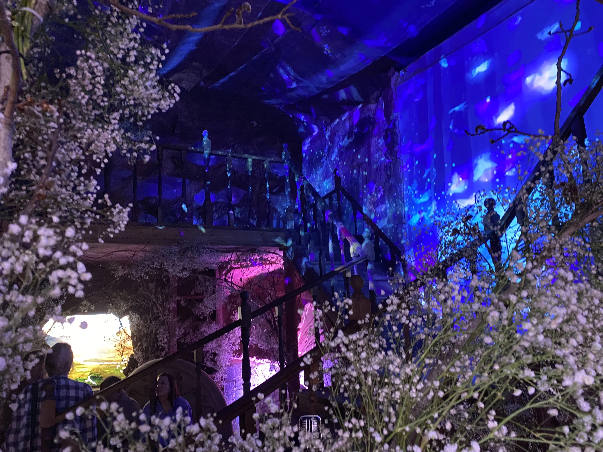
There is a cozy fireplace and a window with a beautiful view.
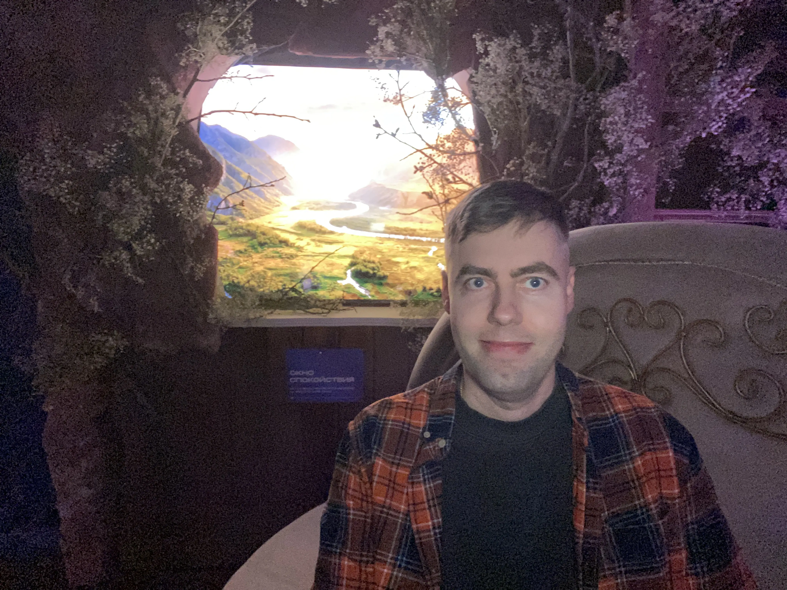
### Swimming on the water lily
There is a lake. There is relaxing music, the lake and huge moon over the lake. You could sit on a sun lounge and relax.
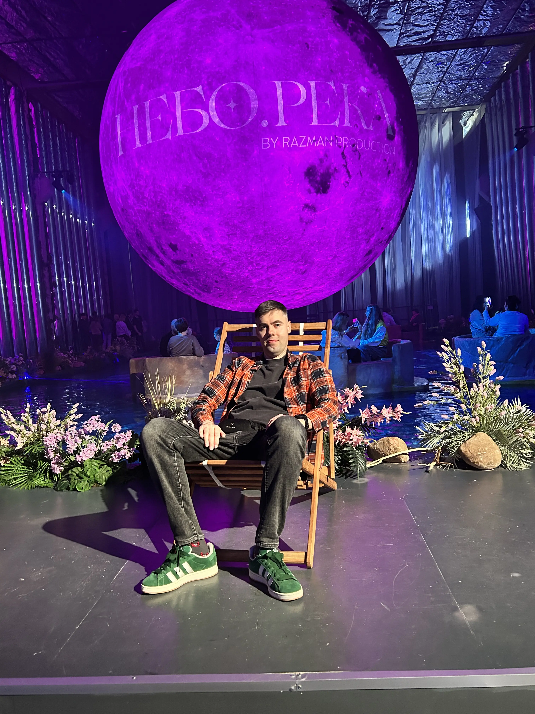
You could swim on a gigantic water lily. A stuff member gently push your lily forward using a long branch, so we drifted across the surface of the lake. 
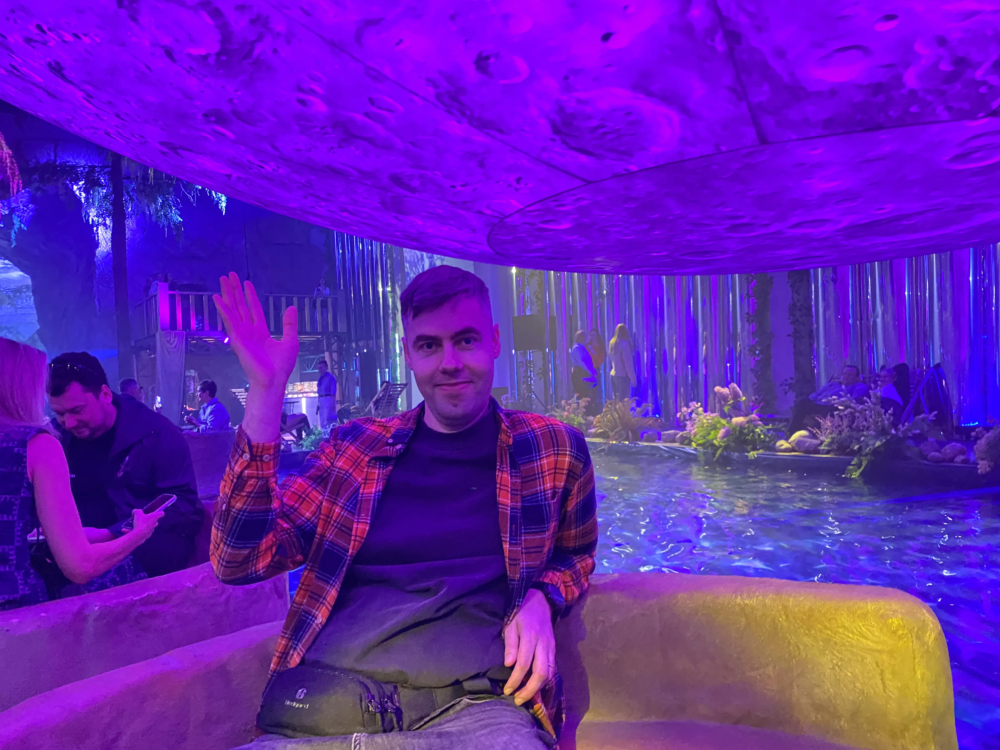
You could also take a small photo session on the tiny island of the lake
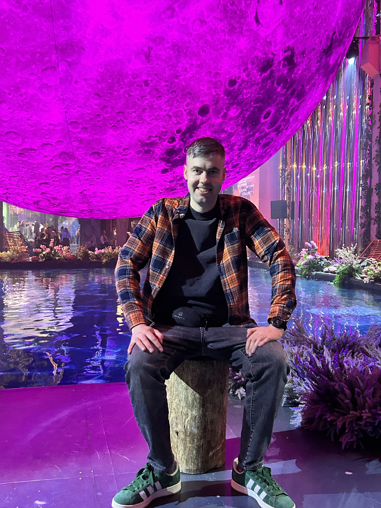

interesting твердое S N
AT exhibition