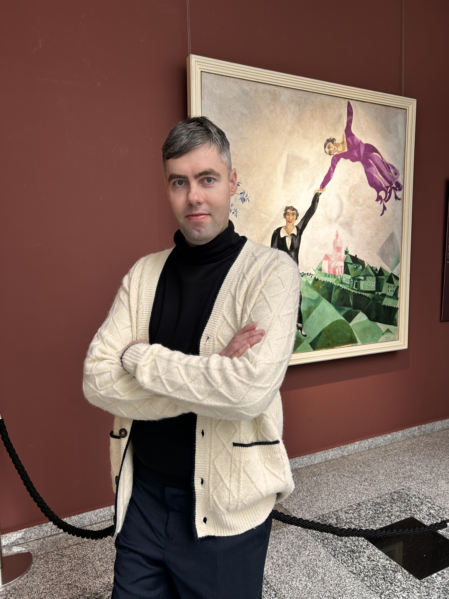
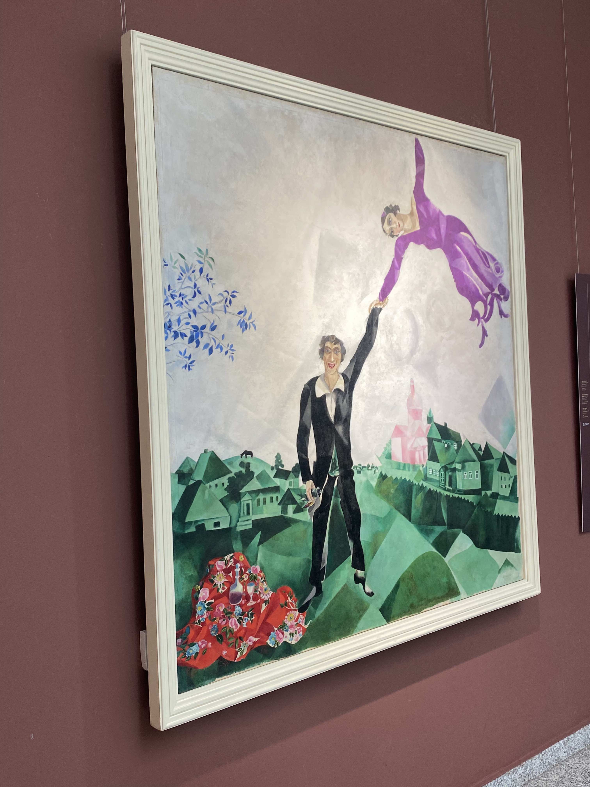
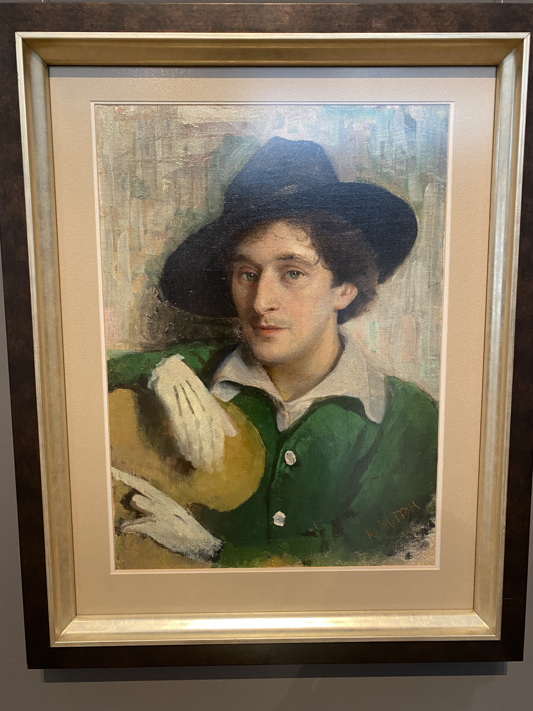

# I visited a National Art Gallery for one painting.
## 11.04.2026
## The painting of Marc Chagall is in Minsk now!
The panting "The Promenade" was exposed in Minsk for several month. I used this possibility to watch a masterpiece. My wife and I bought two tickets and came in the National Art Gallery.

This is the second part of three-part series. The artis painted his wife Bella and himself. The painting consists from geometrical forms like triangle. It feels happy, calm and peaceful.

There is a bottle of wine, a blanket on a field and green fields near his home city. It adds positive mood. The artist wait a marriage for 6 years. Because he lived in Paris. Like other belarusian artists who reached a success and a fame.  

I found a painting of young Chagall on the second flour of Gallery. I interested how seems Chagall in reality because he painted himself in another way.

I enjoyed this visit. After that we left the Gallery because other paintings we have seen many times.